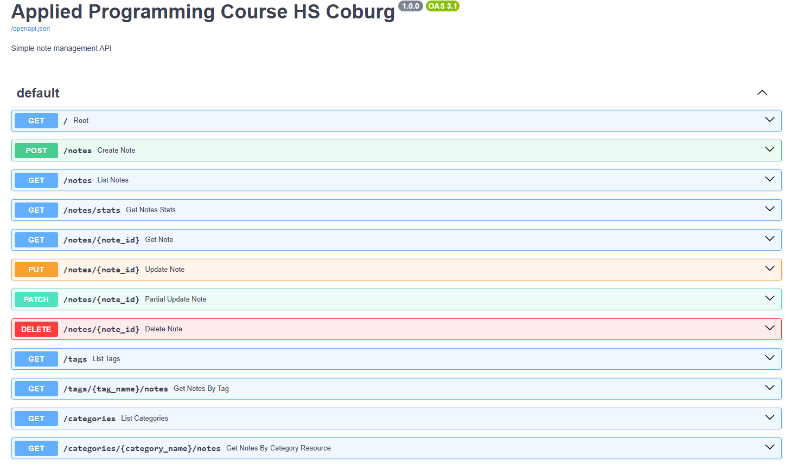
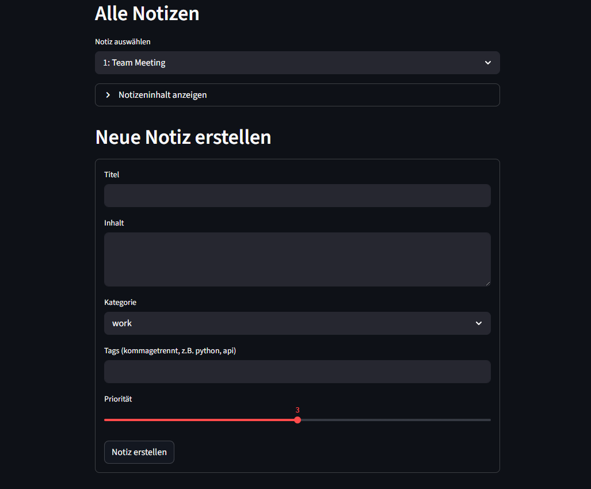
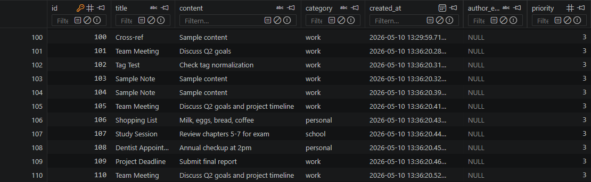

#Inspiration for this ReadMe File came from: https://github.com/aurumz-rgb/ReviewAid/#readme
#and: https://github.com/Abblix/Oidc.Server#readme


# 📝 Note Taking API

A RESTful API for managing notes, built with FastAPI and SQLite.  
Includes a Streamlit frontend for easy interaction.

[](https://www.python.org/downloads/)
[](https://fastapi.tiangolo.com/)
[](https://streamlit.io/)
[](https://www.sqlite.org/)

---

## 📖 What is FastAPI?

FastAPI is a modern Python web framework for building APIs.  
It automatically generates interactive documentation, handles data validation, and converts Python objects to JSON — all with minimal code.

Key advantages:
- Automatic `/docs` page (Swagger UI) for testing endpoints directly in the browser
- Data validation via Pydantic models
- Fast development and high performance

---

## 🚀 Features

- **Full CRUD** — Create, Read, Update, Delete notes
- **Tag system** — Assign multiple tags per note (Many-to-Many)
- **Category filtering** — Organize notes by category
- **Search** — Filter notes by title or content
- **Date filtering** — Filter notes by creation date
- **Priority** — Rate note importance from 1 to 5
- **Email field** — Optionally attach an author email to a note
- **Input validation** — Pydantic validators reject bad data before it reaches the database
- **Streamlit frontend** — Web interface for viewing and creating notes
- **Automated tests** — pytest test suite covering all major endpoints

---

## 🗂️ Project Structure

```
note-api/
├── main.py              # FastAPI backend — all endpoints and database models
├── frontend.py          # Streamlit frontend — web interface
├── test_notes_api.py    # pytest test suite
├── notes.db             # SQLite database (auto-created on first run)
├── data/
│   └── notes.json       # Legacy JSON storage from Day 2 (kept for reference)
└── README.md
```

---

## ⚙️ Installation

**1. Clone the repository**
```bash
git clone <your-repo-url>
cd note-api
```

**2. Install dependencies**
```bash
uv add fastapi sqlmodel pydantic streamlit requests pytest
```

---

## ▶️ Running the Application

**Start the FastAPI backend:**
```bash
uv run fastapi dev main.py
```

The API will be available at:
- API: `http://127.0.0.1:8000`
- Interactive docs: `http://127.0.0.1:8000/docs`



**Start the Streamlit frontend** (in a second terminal):
```bash
uv run streamlit run frontend.py
```

The frontend will be available at `http://localhost:8501`



---

## 🧪 Running Tests

Start the FastAPI server first, then run the tests in a second terminal:

```bash
# Terminal 1 — start the server
uv run fastapi dev main.py

# Terminal 2 — run the tests
uv run pytest test_notes_api.py -v
```

Expected output:

```
test_notes_api.py::test_create_note          PASSED
test_notes_api.py::test_get_all_notes        PASSED
test_notes_api.py::test_delete_note          PASSED
```

---


## 📡 API Endpoints
### Notes

| Method | Endpoint | Description |
|--------|----------|-------------|
| `POST` | `/notes` | Create a new note |
| `GET` | `/notes` | List all notes (with optional filters) |
| `GET` | `/notes/{note_id}` | Get a specific note by ID |
| `PUT` | `/notes/{note_id}` | Fully update a note |
| `PATCH` | `/notes/{note_id}` | Partially update a note |
| `DELETE` | `/notes/{note_id}` | Delete a note |
| `GET` | `/notes/stats` | Get statistics about all notes |

### Tags

| Method | Endpoint | Description |
|--------|----------|-------------|
| `GET` | `/tags` | List all unique tags |
| `GET` | `/tags/{tag_name}/notes` | Get all notes with a specific tag |

### Categories

| Method | Endpoint | Description |
|--------|----------|-------------|
| `GET` | `/categories` | List all unique categories |
| `GET` | `/categories/{category_name}/notes` | Get all notes in a category |

---

## 🔍 Query Parameters (GET /notes)

| Parameter | Type | Description | Example |
|-----------|------|-------------|---------|
| `category` | string | Filter by category | `?category=work` |
| `search` | string | Search in title and content | `?search=meeting` |
| `tag` | string | Filter by tag | `?tag=urgent` |
| `created_after` | datetime | Only notes after this date | `?created_after=2026-04-01` |
| `created_before` | datetime | Only notes before this date | `?created_before=2026-04-30` |

All parameters are optional and can be combined.


---


## 📋 Data Models

### NoteCreate (Input)

```json
{
  "title": "Team Meeting",        # required, 3–100 chars
  "content": "Discuss Q2 goals",  # required, 1–10000 chars
  "category": "work",             # required, must be one of allowed categories
  "tags": ["urgent", "meeting"],  # optional, max 10 tags
  "priority": 3,                  # optional, 1–5 (default: 3)
  "author_email": "user@uni.de"   # optional, must be valid email format
}
```

### NoteResponse (Output)
```json
{
  "id": 1,
  "title": "Team Meeting",
  "content": "Discuss Q2 goals",
  "category": "work",
  "tags": ["urgent", "meeting"],
  "priority": 3,
  "author_email": "user@uni.de",
  "created_at": "2026-05-01T10:30:00"
}
```

---

## 🛡️ Input Validation

The API uses Pydantic to validate all incoming data. Invalid requests return HTTP `422 Unprocessable Entity`.

**Examples of rejected input:**

```json
{ "title": "" }              → 422: title too short (min 3 chars)
{ "title": "ok", "category": "banana" } → 422: category not allowed
{ "tags": ["", "urgent"] }   → 422: empty tags not allowed
{ "priority": 10 }           → 422: priority must be between 1 and 5
{ "unknown_field": "xyz" }   → 422: extra fields forbidden
```

**Tag normalization** — tags are automatically cleaned before saving, for example:

  ["URGENT", "urgent", "  meeting  ", "Q2"]
  transforms into→ ["urgent", "meeting", "q2"]


---


## 🗄️ Database Architecture

The app uses **SQLite** via SQLModel


The `notetaglink` table enables the **Many-to-Many** relationship between notes and tags — one note can have many tags, and one tag can belong to many notes.



---

## 🔑 Key Code Concepts

### Session Dependency
Every endpoint receives a database session automatically via FastAPI's dependency injection:
```python
SessionDep = Annotated[Session, Depends(get_session)]

@app.get("/notes")
def list_notes(session: SessionDep):
    # session is created fresh for this request
    # and closed automatically when done
```

### Get or Create Tag
Before saving a tag, the API checks if it already exists in the database.  
This prevents duplicate entries — `"urgent"` exists only once no matter how many notes use it:
```python
existing_tag = session.exec(select(Tag).where(Tag.name == tag_name)).first()
tag_objects.append(existing_tag if existing_tag else Tag(name=tag_name))
```

### session.refresh()
After `session.commit()`, the Python object doesn't yet know its generated ID or linked tags.  
`session.refresh()` fetches the updated data back from the database:
```python
session.add(db_note)
session.commit()
session.refresh(db_note)  # now db_note.id and db_note.tags are available
```

---

## 🌐 Streamlit Frontend

The frontend connects to the running FastAPI backend at `http://localhost:8000`.

**Funktion 1 — View Notes:**
- Loads all notes from the API on page load
- Displays notes as a dropdown (ID + title)
- Selecting a note shows full details in an expandable section

**Funktion 2 — Create Note:**
- Form with text inputs, category dropdown, tag input and priority slider
- Submits a POST request to the API on button click
- Page reloads automatically after successful creation

> ⚠️ The FastAPI backend must be running before starting the frontend.

---

## 📊 Statistics Endpoint

`GET /notes/stats` returns an overview of all notes:

```json
{
  "total_notes": 12,
  "by_category": {
    "work": 5,
    "personal": 4,
    "school": 3
  },
  "top_tags": [
    {"tag": "urgent", "count": 8},
    {"tag": "meeting", "count": 5}
  ],
  "unique_tags_count": 15
}
```

---

## 📨 Contact

Don,t ;D
